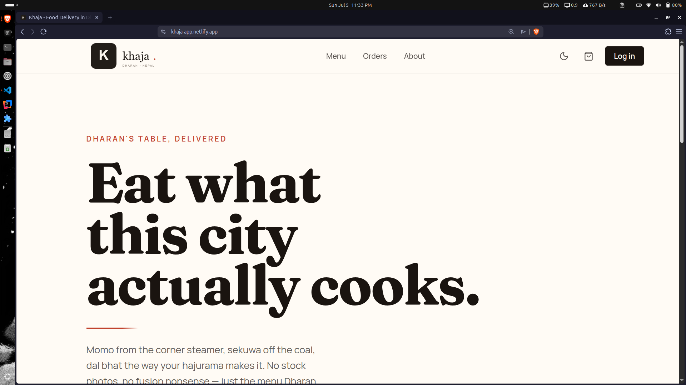
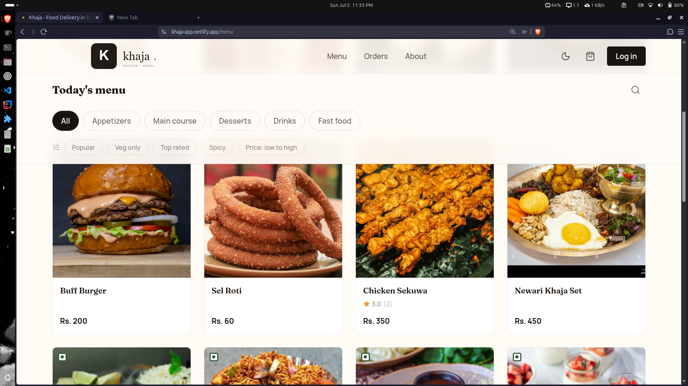
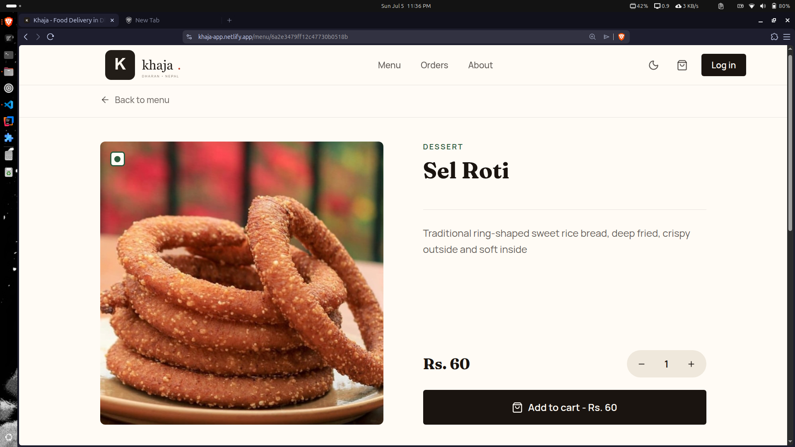

# 🍽️ Khaja

A modern full-stack food delivery platform built for **Dharan, Nepal** using the **MERN stack**. The application provides secure authentication, real-time order tracking, Khalti payment integration, and a complete admin dashboard for managing the platform.

🌐 **Live Demo:** https://khaja-app.netlify.app

> **Note:** The backend is hosted on Render's free tier, so the first request may take **30–60 seconds** after inactivity.

---

## ✨ Features

### Customer

- Secure JWT authentication
- Email OTP password reset
- Browse food menu
- Product search and filtering
- Shopping cart management
- Khalti ePayment integration
- Cash on Delivery support
- Real-time order status updates
- Product reviews and ratings
- Like/Dislike reviews
- User profile with avatar upload
- Dark mode
- Fully responsive UI

### Admin

- Dashboard overview
- Product management
- Order management
- User management
- Review moderation
- Reply to customer reviews

---

## 🛠 Tech Stack

### Frontend

- React
- Redux Toolkit
- React Router
- Tailwind CSS
- React Hook Form
- Zod
- Axios
- Socket.IO Client

### Backend

- Node.js
- Express.js
- MongoDB
- Mongoose
- JWT Authentication
- Socket.IO
- Cloudinary
- Multer
- Nodemailer

### Deployment

- Netlify
- Render
- MongoDB Atlas

---

## 📁 Project Structure

```text
khaja-food-delivery
│
├── client
│   ├── src
│   │   ├── api
│   │   ├── app
│   │   ├── components
│   │   ├── context
│   │   ├── features
│   │   ├── hooks
│   │   ├── layouts
│   │   ├── pages
│   │   └── routes
│   └── ...
│
├── server
│   ├── src
│   │   ├── config
│   │   ├── controllers
│   │   ├── middlewares
│   │   ├── models
│   │   ├── routes
│   │   ├── socket
│   │   └── utils
│   └── ...
│
└── README.md
```

---

## 🚀 Getting Started

### 1. Clone the repository

```bash
git clone https://github.com/RaiYunan/khaja-food-delivery.git

cd khaja-food-delivery
```

### 2. Backend

```bash
cd server

pnpm install

cp .env.example .env

pnpm dev
```

### 3. Frontend

```bash
cd client

pnpm install

cp .env.example .env

pnpm dev
```

---

## 🔑 Environment Variables

Create a `.env` file inside both the **client** and **server** directories.

Example configurations are available in:

```text
client/.env.example
server/.env.example
```

---

## 📸 Screenshots

### Home



### Menu



### Product Details



---

## 🚧 Future Improvements

- Google Authentication
- Push notifications
- Coupon & discount system
- Wishlist
- Delivery partner dashboard
- Analytics & reporting

---

## 👨‍💻 Author

**Yunan Rai**

Built to strengthen full-stack development skills by implementing production-style features including authentication, payments, real-time communication, image uploads, and admin management.

---

## 📄 License

This project is licensed under the MIT License.
